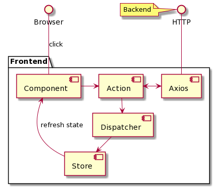

# Frontend

The client side (frontend) of the web application was implemented in React with Bootstrap. 

##### Technologies
 - node, npm - interpreter and package manager
 - Bootstrap, node-sass - CSS generation, layout and design
 - jest - testing
 - eslint - syntax and style checker
 - husky - pre-commit hook for code quality
 - flux - unidirectional dataflow, state management
 - axios - AJAX requests.

## Architecture

The architecture of the fronted can be seen the Figure below.
This figure presents the Unidirectional Data Flow of Flux with extension of Axios. 

The frontend provides user interface and communicates with the backend. 
The browser is the user interface which renders everything and provides controller elements for the user. 
The backend is accessed via HTTP. 

Frontend distinguishes the components, actions and stores while uses the Dispatcher and Axios as 3rd party tools. 

Components are the core elements of the React framework and they will be rendered in the browser. 
In other words, the components are the view of the application. 

Components can render visual control elements such as buttons and forms. 
These elements can handle the user iteractions and forward these events to the corresponding actions.

Actions separates the handling of the event from the visualization. 
Actions also implements a Command Design Pattern and they are reusable. 
Finally actions can perform AJAX requests with Axios. 
The fetched data is forwarded to the dispatcher which is reliable for broadcasting events/actions. 
AJAX requests should be performed in the Action. 

Dispatcher is the central element of Flux.
Actions produce events/actions for the Dispatcher which are consumed by the Stores. 
Dispatcher broadcast all messages. 
This messaging pattern can be compared to Message Queue and Publish/Subscribe Model. 

_Note:_ 
The term Actions is ambiguous. 
It may refer to the Action which hanled user events due to the Command/Action Design Pattern.
It can refer the the dispached actions of the Dispatcher of Flux.

Stores are used to store the shared state of Components. 
Stores implements event emitters and they implement the Observer Design Pattern. 
Actions of Dispatcher are consumed by Stores. 

---
# Generated Readme for React Apps
This project was bootstrapped with [Create React App](https://github.com/facebook/create-react-app).

## Available Scripts

In the project directory, you can run:

### `npm start`

Runs the app in the development mode. 
Open [http://localhost:3000](http://localhost:3000) to view it in the browser.

The page will reload if you make edits. 
You will also see any lint errors in the console.

### `npm test`

Launches the test runner in the interactive watch mode. 
See the section about [running tests](https://facebook.github.io/create-react-app/docs/running-tests) for more information.

### `npm run build`

Builds the app for production to the `build` folder. 
It correctly bundles React in production mode and optimizes the build for the best performance.

The build is minified and the filenames include the hashes. 
Your app is ready to be deployed!

See the section about [deployment](https://facebook.github.io/create-react-app/docs/deployment) for more information.

### `npm run eject`

**Note: this is a one-way operation. Once you `eject`, you can’t go back!**

If you aren’t satisfied with the build tool and configuration choices, you can `eject` at any time. This command will remove the single build dependency from your project.

Instead, it will copy all the configuration files and the transitive dependencies (webpack, Babel, ESLint, etc) right into your project so you have full control over them. All of the commands except `eject` will still work, but they will point to the copied scripts so you can tweak them. At this point you’re on your own.

You don’t have to ever use `eject`. The curated feature set is suitable for small and middle deployments, and you shouldn’t feel obligated to use this feature. However we understand that this tool wouldn’t be useful if you couldn’t customize it when you are ready for it.

## Learn More

You can learn more in the [Create React App documentation](https://facebook.github.io/create-react-app/docs/getting-started).

To learn React, check out the [React documentation](https://reactjs.org/).

### Code Splitting

This section has moved here: https://facebook.github.io/create-react-app/docs/code-splitting

### Analyzing the Bundle Size

This section has moved here: https://facebook.github.io/create-react-app/docs/analyzing-the-bundle-size

### Making a Progressive Web App

This section has moved here: https://facebook.github.io/create-react-app/docs/making-a-progressive-web-app

### Advanced Configuration

This section has moved here: https://facebook.github.io/create-react-app/docs/advanced-configuration

### Deployment

This section has moved here: https://facebook.github.io/create-react-app/docs/deployment

### `npm run build` fails to minify

This section has moved here: https://facebook.github.io/create-react-app/docs/troubleshooting#npm-run-build-fails-to-minify

